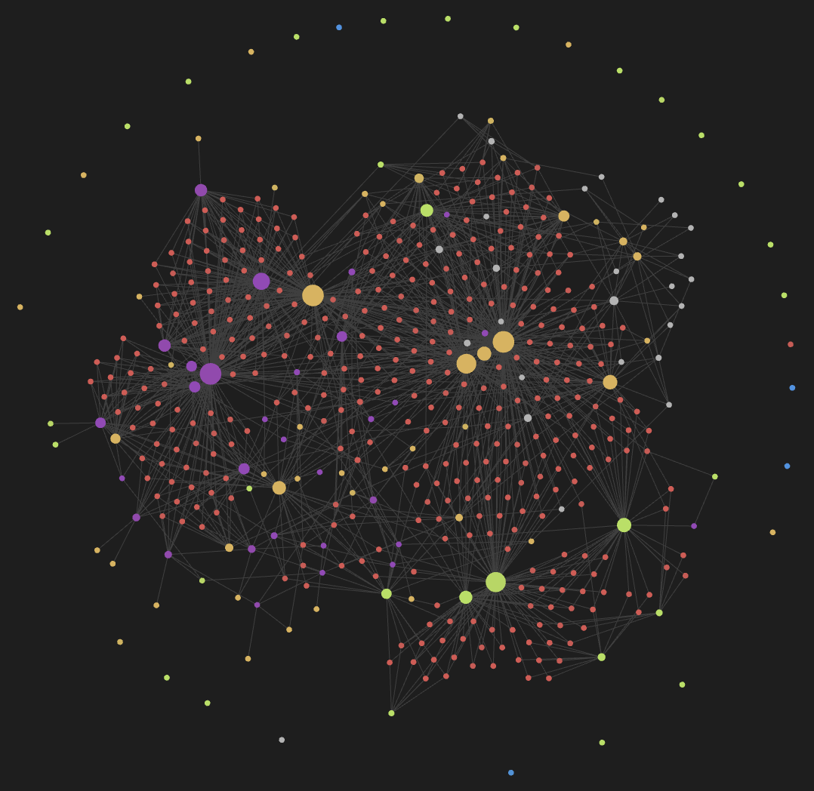
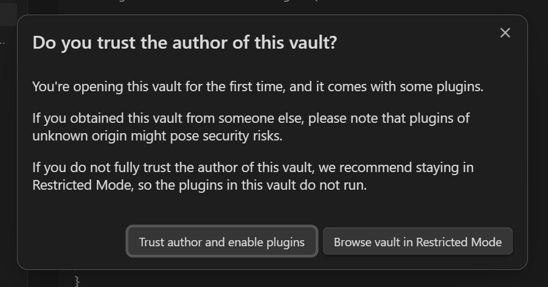
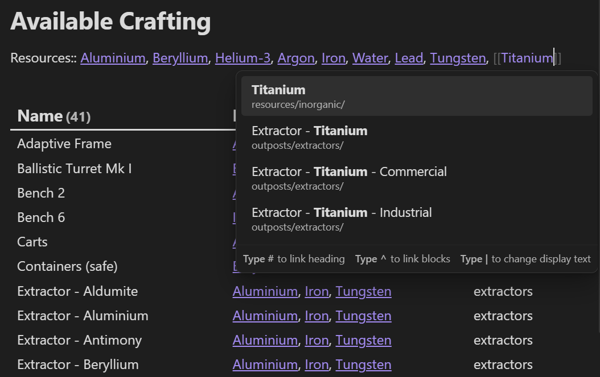
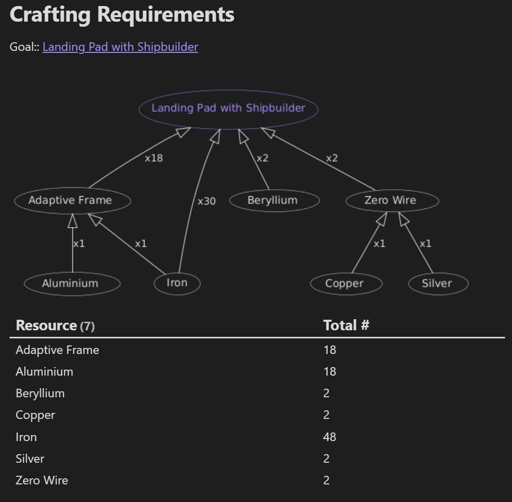
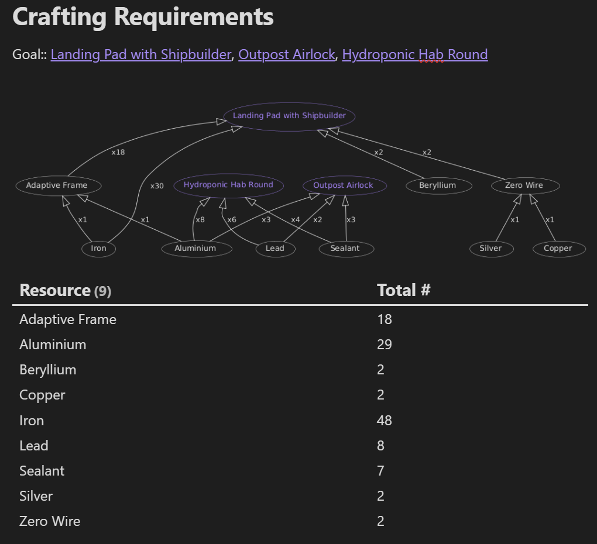
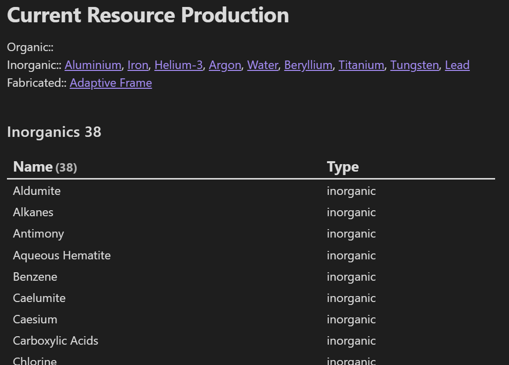

# starfield-obsidian-planner
A resource/crafting planner for Starfield using Obsidian

Index:
- [Installation](#installation)
- [Features](#features)
	- [Available Crafting](#available-crafting)
	- [Crafting Requirements](#crafting-requirements)
	- [Current Resource Production](#current-resource-production)
- [Plans/Todo](#plans-and-todo)

This visual represents different notes in the vault and how they relate. A dot is larger if it has more links to other notes. I've found this useful for identifying which resources are used by more crafting recipes - hovering over the large dots highlights the connected recipes, and names the note

### Installation
1. Download this repository
	- Clone the repository with git, or
	- Use the "Download Zip" button at the top of this page, under the "Code" button
		- If you download the zip, be sure to unzip it before the next step with a program like  [7zip](https://www.7-zip.org/)
2. Install [Obsidian](https://obsidian.md)
3. Open the downloaded repository as a new vault
4. Trust the author
	- As Obsidian itself warns, you shouldn't enable plugins on a vault that is created by an author you don't trust. I'm a stranger, I'm untrustworthy - however, all the code written by me can be seen in this repository. This allows viewers (like you) to verify that I've not written anything malicious 
	- Code that I've written can be seen in
		- [Available Crafting](available%20crafting.md), [Crafting Requirements](crafting%20requirements.md), and [Current Resource Production](current%20resource%20production.md)
	- This vault uses two plugins - [Dataview](https://blacksmithgu.github.io/obsidian-dataview/) and [PlantUML](https://github.com/joethei/obsidian-plantuml). These are required plugins for collating the data and generating the diagram. You can see the list of installed plugins [here](.obsidian/plugins) and [here](.obsidian/community-plugins.json) before downloading the repository - this way you know I'm not trying to sneak a malicious plugin past you
	- If you're still not sure, err on the side of caution and **DO NOT TRUST**
5. The vault should automatically open onto the [Crafting Requirements](crafting%20requirements.md) page

### Features
#### Available Crafting
This note creates a data table containing all craftable items available to the player based on the provided resources. The `Resources::` line denotes a list that expects backlinks to be provided. In case you are unfamiliar with Obsidian, backlinks are written as follows: `[[Aluminium]]`
While typing the backlink, Obsidian will provide a pop-up menu that you can use to filter and select resources

This note was developed with the intention of tracking resources that are being produced by player outposts (as I have a terrible memory), however it can obviously account for resources the player has purchased or mined manually and have available

#### Crafting Requirements
This note generates a diagram of the requirements for a given craftable, in addition to a data table with a total count of all resources required. The `Goal::` line expects a list of backlinks to craftables

This note has helped me understand and keep track of what's required for a given outpost. I usually use this when setting up a new outpost, by specifying basic buildings like the [Landing Pad with Shipbuilder](outposts/misc/landing%20pad%20with%20shipbuilder.md), [Outpost Airlock](outposts/structures/outpost%20airlock.md), and [Hydroponic Hab A](outposts/structures/hydroponic%20hab%20a.md). This way I can make sure I always have the resources on me that are required for setting up a basic new outpost

You can also combine several craftables in a single result:

#### Current Resource Production
This note is a simple lookup that allows you to specify which `Organic::`, `Inorganic::`, and `Fabricated::` resources are currently being produced by your outposts. 

I don't use this heavily, but have found it useful for narrowing down which resources I'm currently producing so I know which ones to focus on next when surveying planets

### Plans and Todo
- Add stars/planets/biomes to the vault. I'm experimenting with connecting resources to the biomes they *can* appear in, as well as biomes to the planets they *do* appear in. Ideally this should help with long-term planning of outpost chains  
  This is impractical to do manually, with 1000 stars and some multiple more planets, but I've been experimenting with [xEdit](https://github.com/TES5Edit/TES5Edit) to extract the information automatically. Long term this might result in a custom app to process this info rather than using Obsidian, but that remains to be seen
- Additional functionality in [Available Crafting](available%20crafting.md) to show craftables that can be built with a given resource. This may end up as it's own note
- Have individual tables in [Crafting Requirements](crafting%20requirements.md) for each goal's resources
- Make [Current Resource Production](current%20resource%20production.md) useful. Somehow.